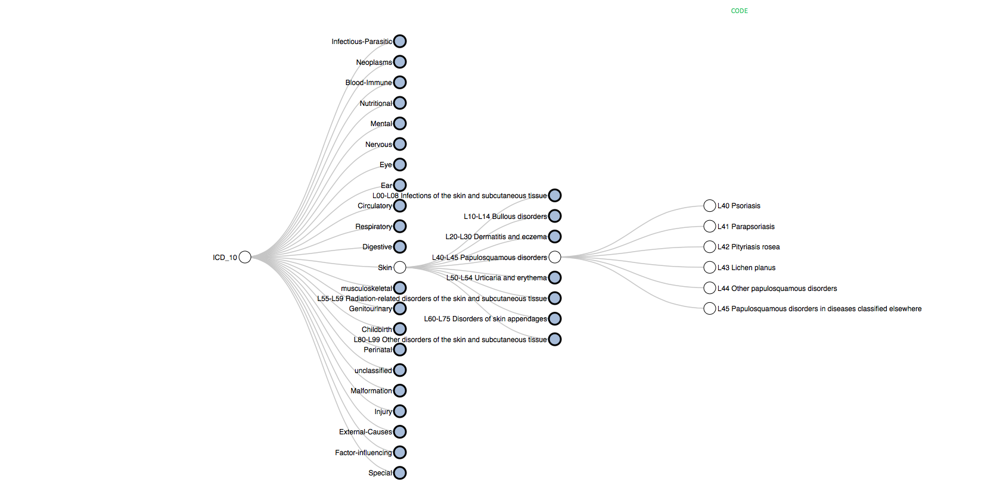
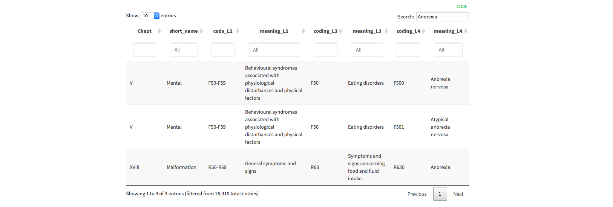

Visualizing the ICD 10 Classification
===================

Overview
--------
> The [World Health Organization](https://en.wikipedia.org/wiki/World_Health_Organization) provides a way to classify human diseases: the [ICD10 Classification](https://en.wikipedia.org/wiki/ICD-10). About 16k diseases are defined and organized. 

This repository create a [webpage](https://holtzy.github.io/Visualizing-the-ICD10-Classification/) that provides a few way to **visualize** and **search** this information.

Have a look to the page [here](https://holtzy.github.io/Visualizing-the-ICD10-Classification/)

For example, the classification can be explored through an interactive tree. Clicking on the nodes allows to go from one group to a subgroup and so on.

An interactive table is also provided. The research bar allows to immediately find out where a disease is classified:

